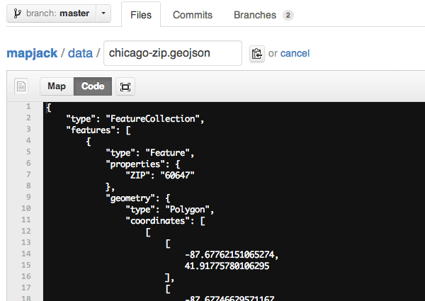

# mapjack

## What it does

Mapjack hacks in a map editor next to GitHub's normal text editor when you are editing GeoJSON files.

## Getting it

Mapjack is distributed as a Greasemonkey-style user script.  It should work with either [Greasmonkey](https://addons.mozilla.org/en-US/firefox/addon/greasemonkey/) in Firefox or [Tampermonkey](https://chrome.google.com/webstore/detail/dhdgffkkebhmkfjojejmpbldmpobfkfo) in Chrome.  Note that it won't work as a straight [user script](http://www.chromium.org/developers/design-documents/user-scripts) in Chromium because it depends on `unsafeWindow` (be warned!).

The script is hosted here: [tschaub.net/mapjack/mapjack.user.js](http://tschaub.net/mapjack/mapjack.user.js)

Installation instructions depend on the extension you're using.  Until you find more detail here, look to the extension docs for user script installation.

## Using it

After installing you can view any `.geojson` file on GitHub, click the "Edit" button, and get a map editor (hot tip: you can find some sample GeoJSON files to experiment with in the [mapjack repo](https://github.com/tschaub/mapjack/tree/master/data)).

The editing workflow is pretty bare bones right now.  To modify an existing shape, just click and start dragging points around.  Click a "ghost" vertex to add a new point.  Click "d" while hovering over a vertext to delete.  No support for adding new features or removing entire features right now.  To finish editing, click back to the "Code" tab, enter your commit message, and commit!

**Disclaimer:** This is a late night hack.  Use at your own risk.
